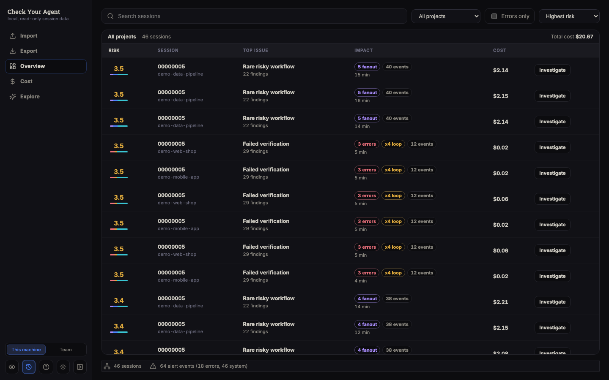
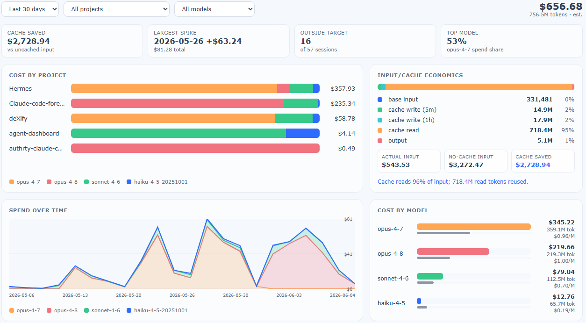
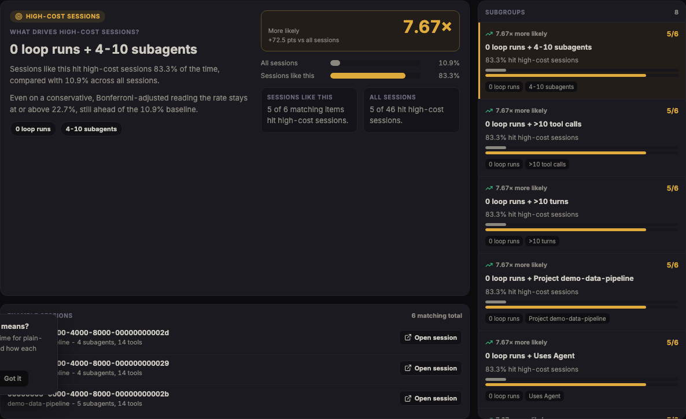
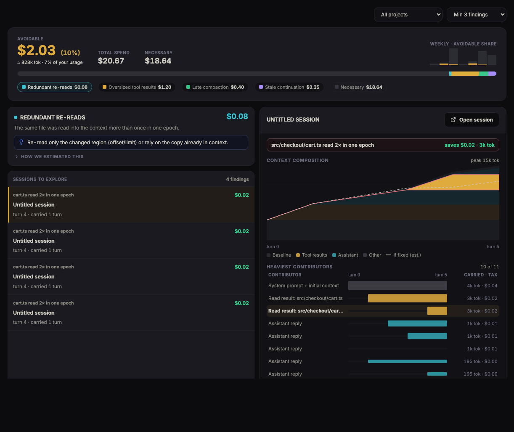
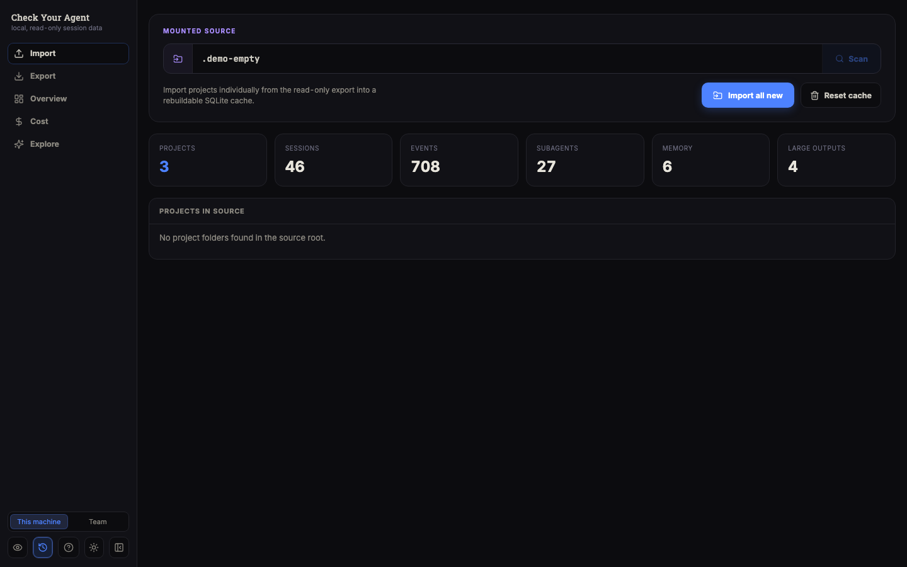
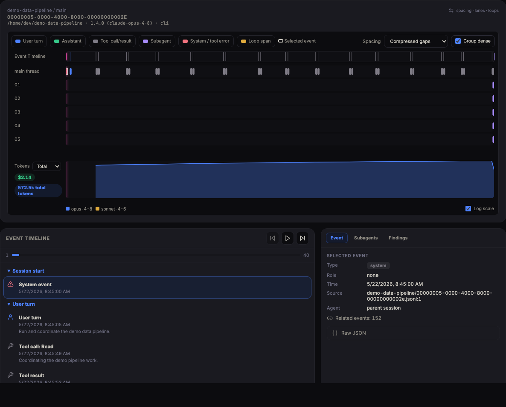
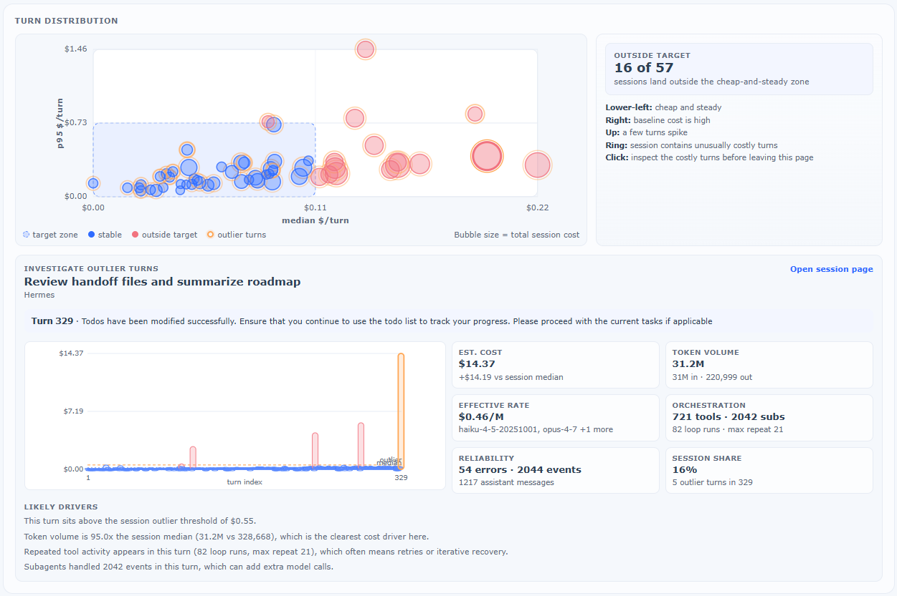

# Claude Analytics

Offline forensic explorer for Claude Code `.claude/projects` exports.

The app mounts raw exports read-only, indexes them into a rebuildable SQLite database, and provides a graph-first UI for inspecting sessions, tool cycles, subagents, errors, and event trails. It does not call external services and does not mutate the raw export.

> [!NOTE]
> **Work in progress.** This project is under active development, and the tooling it analyzes is a moving target: Claude Code's export format, pricing, and agent behavior evolve quickly, and the heuristics and cost models here may lag behind. Findings are estimates derived from local data; treat them as leads to investigate, not ground truth, and expect occasional inaccuracies while both the tool and the ecosystem keep changing.

## At a Glance

Claude Analytics is built around high-signal views: a triage board for finding the sessions that deserve attention, cost analytics for understanding where Claude Code spend comes from, subgroup discovery for surfacing the conditions that drive outcomes like high-cost sessions, and context economics for separating the share of spend that avoidable context waste is responsible for.

| Triage suspicious sessions | Understand cost and token behavior |
| --- | --- |
|  |  |
| **Discover subgroups that drive outcomes** | **Put a price on avoidable context** |
|  |  |

Context economics reconstructs how each session's context window filled up, attributes the carry cost to the content that caused it, and runs detectors for recurring waste patterns — redundant re-reads, oversized tool results, late compaction, and stale session continuation. Each finding comes with a counterfactual savings estimate, and the savings claims are kept disjoint so the avoidable total never double-counts.

## Research Foundation

The current UI is the first layer of a broader research tool for understanding how coding agents behave in real projects. Claude Analytics turns local Claude Code history into inspectable evidence: what tools were used, where loops appeared, how subagents were orchestrated, which sessions became expensive, and which workflows repeatedly produced friction.

That makes it a base for deeper work on coding-agent usage patterns, optimization techniques, cost control, prompt and workflow design, failure-mode analysis, and human-in-the-loop review. The project deliberately keeps raw exports read-only and rebuilds its own local cache, so experiments can be repeated without mutating the source data.

## Usage Flow

1. Import Claude Code exports from the mounted read-only source.
2. Use the triage board to sort sessions by risk, errors, loops, fanout, volume, or cost.
3. Open a session to inspect the event trace, timeline, subagents, tool usage, and raw evidence.
4. Review cost analytics to spot expensive projects, model mix, cache savings, and costly turns.
5. Open context economics to see how much spend was avoidable, which waste archetypes drive it, and the exact events behind each finding.

| Import exports | Inspect a session | Investigate cost outliers |
| --- | --- | --- |
|  |  |  |

## Historical (time-aware) pricing

Model prices change over time, so the cost views can value each session either at the rate in effect on its date or at today's rate. A **Historical pricing** toggle in the sidebar flips between the two:

- **On** (default) — each session's spend is priced at the rates effective on its own date.
- **Off** — every session is valued at the current rate.

Prices come from CSVs of US dollars per million tokens:

- `pricing.csv` (repo root) is the **undated baseline**, effective from the beginning of time.
- Each `pricing/pricing-YYYY-MM-DD.csv` is a full price snapshot that takes effect on the date in its filename. A session is priced by the baseline overlaid with every snapshot whose date is on or before the session's date (later snapshots win per model).

To record a price change, drop a new `pricing/pricing-YYYY-MM-DD.csv` with the same columns as `pricing.csv` — never edit old snapshots. Both `pricing.csv` and the `pricing/` directory are mounted read-only into the Docker backend and reloaded per request, so price edits take effect on the next request without a rebuild. With no `pricing/` directory the app prices everything at the baseline.

## Project Docs

- [Contributing](CONTRIBUTING.md)
- [Security](SECURITY.md)
- [Privacy and Data Handling](PRIVACY.md)
- [Code of Conduct](CODE_OF_CONDUCT.md)

## Run With Docker

```powershell
docker compose down --remove-orphans
docker compose up --build
```

Open:

```text
Frontend: http://localhost:5173
Backend API docs: http://localhost:8000/docs
```

By default `docker-compose.yml` mounts the local `Data/` folder as `/imports` for the backend service. Both containers bind to host loopback only; the backend serves API routes and the frontend is served by a separate container.

## Local Backend

```powershell
cd backend
uv run --extra dev pytest
uv run uvicorn ccfr.main:app --reload --host 127.0.0.1 --port 8000
```

When run outside Docker, the backend defaults to:

```text
CCFR_IMPORT_ROOT=../Data
CCFR_DB_PATH=../.ccfr-data/ccfr.sqlite3
```

Set those environment variables before starting `uvicorn` if you want to index a different export root or store the rebuildable SQLite cache elsewhere.

Restarting the backend does not clear the local SQLite cache. Use **Run Import** in the UI to rebuild it from `CCFR_IMPORT_ROOT`, or delete `../.ccfr-data/ccfr.sqlite3` while the backend is stopped.

To verify that the running backend is the current local code:

```powershell
Invoke-RestMethod http://127.0.0.1:8000/api/config
```

If that returns `404`, an older backend process is still serving port `8000`. The backend no longer serves the React frontend at `/`; use `http://127.0.0.1:8000/docs` for browser-based API inspection.

## Local Frontend

```powershell
cd frontend
npm install
npm run dev
```

Open:

```text
http://localhost:5173
```

The dev server proxies `/api` to the backend (`http://localhost:8000`), so the frontend talks to it same-origin — no CORS setup, and the dev port doesn't matter. `VITE_API_BASE` is unset by default (relative `/api`); set it only when the backend isn't reachable via the dev proxy (a remote host, or a built/Docker frontend). If you previously exported `VITE_API_BASE`, unset it so the proxy is used.
